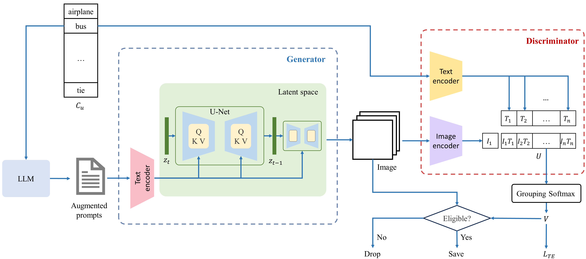

# Diverse and Tailored Image Generation for Zero-shot Multi-label Classification

Official PyTorch Implementation

> Kaixin Zhang, Zhixiang Yuan, Tao Huang </br>
> Anhui University of Technology, The University of Sydney

**Abstract**
Recently, zero-shot multi-label classification has garnered considerable attention for its capacity to operate predictions on unseen labels without human annotations. Nevertheless, prevailing approaches often use seen classes as imperfect proxies for unseen ones, resulting in suboptimal performance. Drawing inspiration from the success of text-to-image generation models in producing realistic images, we propose an innovative solution: generating synthetic data to construct a training set explicitly tailored for proxyless training on unseen labels. Our approach introduces a novel image generation framework that produces multi-label synthetic images of unseen classes for classifier training. To enhance diversity in the generated images, we leverage a pre-trained large language model to generate diverse prompts. Employing a pre-trained multi-modal CLIP model as a discriminator, we assess whether the generated images accurately represent the target classes. This enables automatic filtering of inaccurately generated images, preserving classifier accuracy. To refine text prompts for more precise and effective multi-label object generation, we introduce a CLIP score-based discriminative loss to fine-tune the text encoder in the diffusion model. Additionally, to enhance visual features on the target task while maintaining the generalization of original features and mitigating catastrophic forgetting resulting from fine-tuning the entire visual encoder, we propose a feature fusion module inspired by transformer attention mechanisms. This module aids in capturing global dependencies between multiple objects more effectively. Extensive experimental results validate the effectiveness of our approach, demonstrating significant improvements over state-of-the-art methods.



## Generate text prompts
We have provided ready-to-use text prompts in `<./generate_image_coco>/prompt_coco` and `<./generate_image_nus>/prompt_nus`, so there is no need to generate them again.
### coco
```
torchrun --nproc_per_node 1 ./generate_prompt/example_chat_completion.py --ckpt_dir <path to Llama-2-7b-chat> --tokenizer_path <path to tokenizer.model> --dataset_name coco --text_save_path ./generate_prompt/save_prompt/ --max_seq_len 1000 --max_batch_size 4
```
### nus
```
torchrun --nproc_per_node 1 ./generate_prompt/example_chat_completion.py --ckpt_dir <path to Llama-2-7b-chat> --tokenizer_path <path to Llama-2-7b-chat/tokenizer.model> --dataset_name nus --text_save_path ./generate_prompt/save_prompt/ --max_seq_len 1000 --max_batch_size 4
```

## Generate synthetic images (Inference)
Pre-trained stable diffusion (SD) parameters can be used to generate synthetic images for training classification models.
**SD**: You can download pre-trained SD parameters on [Hugging face](https://huggingface.co/stabilityai/stable-diffusion-2). Moveing all files into `<./generate_image_coco>/stabilityai/stable-diffusion-2` and `<./generate_image_nus>/stabilityai/stable-diffusion-2` for using in the inference and fine-tuning.
### coco
```
CUDA_VISIBLE_DEVICES=0 python ./generate_image_coco/inference.py --outdir ./generate_image_coco/all_result/inference --prompt_path ./generate_image_coco/prompt_coco/ --ckpt_dir <path to fine-tuned text encoder weight> -mmln=2 -test_scale=768 -steps=50 -syn_num=200
```
### nus
```
CUDA_VISIBLE_DEVICES=0 python ./generate_image_nus/inference.py --outdir ./generate_image_nus/all_result/inference/ --prompt_path ./generate_image_nus/prompt_nus/ --ckpt_dir <path to fine-tuned text encoder weight> -mmln=2 -test_scale=768 -steps=50 -syn_num=200
```

## Fine-tune text encoder of SD (Train)
### coco
```
CUDA_VISIBLE_DEVICES=0 python ./generate_image_coco/inpainting_diff.py --outdir ./generate_image_coco/all_result/train --prompt_path ./generate_image_coco/prompt_coco/ -accumulation_steps=1 -mmln=2 -train_scale=560 -test_scale=768 -lr=7e-8 -epoch=4000 -steps=30
```
### nus
```
CUDA_VISIBLE_DEVICES=0 python ./generate_image_nus/inpainting_diff.py --outdir ./generate_image_nus/all_result/train --prompt_path ./generate_image_nus/prompt_nus/ -accumulation_steps=1 -mmln=2 -train_scale=560 -test_scale=768 -lr=7e-8 -epoch=26000 -steps=30
```

## Train classification model
**MS-COCO**: We follow [1, 2] to split the dataset into
48 seen classes and 17 unseen classes. We provide the json files of the seen and unseen annotations on [Google Drive](https://drive.google.com/file/d/154dkD7Ok1xxwTZb7hQTAf3FlNCN8Q6KM/view?usp=sharing). Download and move all files into `<coco_dataroot>/annotations/` for using in the training and inference.
**NUS-WIDE**: Following [2, 3] we use 81 human-annotated categories as unseen classes and an additional set of 925 labels
obtained from Flickr tags as seen classes. We provide the class split on [Google Drive](https://drive.google.com/file/d/17pt25ed0qPvjjidVa_goAuH9PnS2lIfs/view?usp=sharing). Download and move those folders  into `<nus_wide_dataroot>/annotations/` for using in the training and inference.

### Dataset file
```shell
Dataset
├── coco
│   ├── annotations
│   ├── train2014
│   ├── val2014
│   ├── syn_image
│   └── syn_annotation
│       ├── cls_ids.pickle
│       └── train_instances_only_synthetic.json
└── nus
    ├── Groundtruth
    ├── annotations
    ├── images
    ├── syn_image
    └── syn_annotation
        ├── cls_ids.pickle
        ├── formatted_syn_images_filtered.npy
        └── formatted_syn_labels_filtered.npy
```
### coco
```
CUDA_VISIBLE_DEVICES=0 python ./classification_coco/train_zsl.py --config_file ./classification_coco/configs/models/rn50_ep50.yaml --datadir <path to dataset> --dataset_config_file ./classification_coco/configs/datasets/coco.yaml --input_size 224 --lr 0.002  --loss_w 0.01  --n_ctx_pos 64 --n_ctx_neg 64 --train_batch_size 32
```
### nus
```
CUDA_VISIBLE_DEVICES=0 python ./classification_nus/train_zsl.py --config_file ./classification_nus/configs/models/rn50_ep50.yaml --datadir <path to dataset> --dataset_config_file ./classification_nus/configs/datasets/nus_wide_zsl.yaml --input_size 224 --lr 0.0005 --loss_w 0.01 --n_ctx_pos 64 --n_ctx_neg 64 --train_batch_size 96
```

## Citation
```
@article{zhang2024diverse,
  title={Diverse and Tailored Image Generation for Zero-shot Multi-label Classification},
  author={Zhang, Kaixin and Yuan, Zhixiang and Huang, Tao},
  journal={arXiv preprint arXiv:2404.03144},
  year={2024}
}
```
## Reference
[1] Ankan Bansal, Karan Sikka, Gaurav Sharma, Rama Chellappa, and Ajay Divakaran. Zero-shot object
detection. In ECCV, 2018.  
[2] Avi Ben-Cohen, Nadav Zamir, Emanuel Ben-Baruch, Itamar Friedman, and Lihi Zelnik-Manor. Semantic
diversity learning for zero-shot multi-label classification. In ICCV, 2021.  

## Contact
Feel free to contact if there are any questions or issues - Kaixin Zhang (kxzhang0618@163.com).
